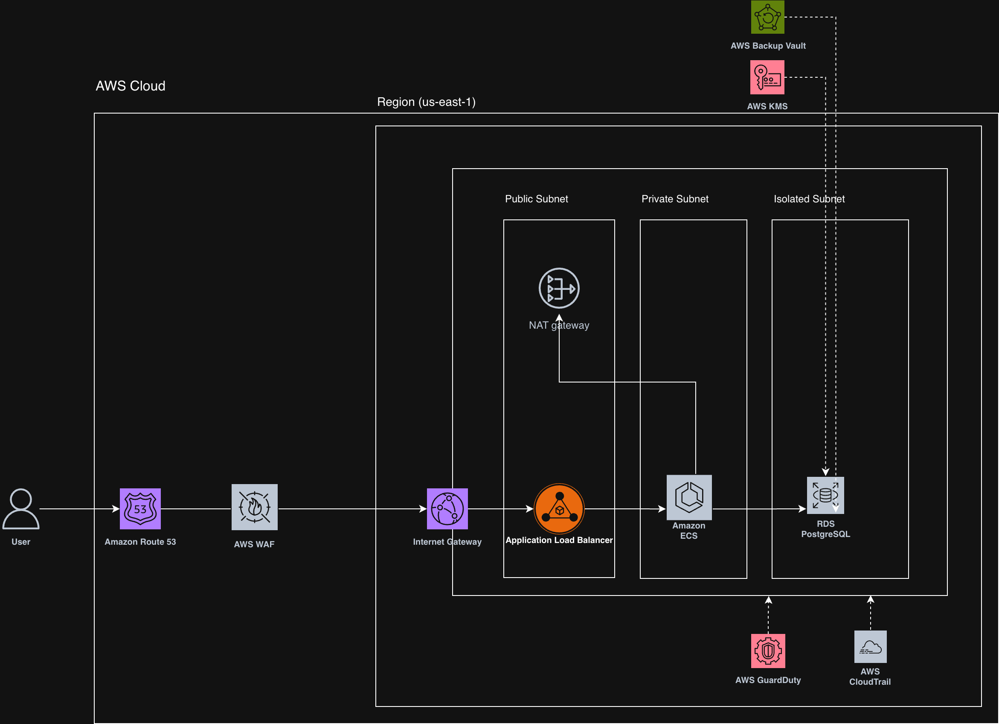

# ClinicFlow: Cloud Operations & Security Proof of Concept

   

> **⚠️ Project Status: Technical Demonstration**
> This repository is a proof-of-concept built to demonstrate cloud operations, infrastructure-as-code (IaC), and compliance principles. It is a portfolio asset, not a production-ready environment, and is **not** configured to process live Protected Health Information (PHI). 

ClinicFlow is an enterprise-grade AWS architecture engineered entirely via Infrastructure as Code (IaC) using Terraform. I built this to deeply understand the architecture, security constraints, and operational realities of compliance-driven cloud environments. 

Instead of treating cloud security as a manual checklist, this project demonstrates how to enforce compliance as an immutable, software-defined state.

## 🏗️ System Architecture

## ⚙️ Core Architectural Pillars

* **Network Isolation:** Multi-tier VPC architecture featuring a WAF, public Application Load Balancer, private ECS Fargate compute layer, and an isolated RDS PostgreSQL database.
* **Zero-Trust Data Layer:** Automated Amazon S3 bucket access logging, object locking, and strict bucket policies configured to block public access out-of-the-box.
* **Event-Driven Security Remediation:** Engineered an auto-healing loop integrating GuardDuty, EventBridge, and a custom Lambda function designed to detect unauthorized API access and trigger IAM session revocation.
* **Dynamic Cryptographic Envelopes:** Data encryption in transit and at rest utilizing customer-managed AWS KMS keys and AWS Backup Vaults.
* **CI/CD Compliance Gates:** Integrated Checkov static analysis directly into GitHub Actions to block pre-deployment infrastructure misconfigurations.

## 📋 Regulatory Compliance Mapping

| Federal Statutory Citation | AWS Technical Implementation | Quantifiable Risk Mitigated |
| :--- | :--- | :--- |
| **HIPAA 164.312(a)(1)** (Access Control) | IAM Least-Privilege Policies & VPC Private Subnets | Prevents unauthorized network and console access to database layers. |
| **HIPAA 164.312(a)(2)(iv)** (Encryption) | AWS KMS (Customer Managed Keys) & TLS 1.2 | Ensures PHI remains cryptographically secure at rest and in transit. |
| **HIPAA 164.312(b)** (Audit Controls) | AWS CloudTrail & S3 Object Lock (WORM) | Creates an immutable, undeletable forensic record of all API calls. |
| **HIPAA 164.308(a)(6)(ii)** (Incident Response) | Amazon GuardDuty + EventBridge + Lambda | Automates immediate threat isolation, reducing time-to-remediation. |

---

## 🚀 The Operational Context
As an operator with 18 years of experience managing zero-tolerance precision manufacturing systems, I built this project to bridge the gap between physical systems logic and cloud infrastructure. 

This repository proves my ability to:
1. Read, write, and deploy Infrastructure-as-Code.
2. Understand the business liability of cloud misconfigurations.
3. Systematically troubleshoot deployment pipelines and AWS environments before escalating a ticket.

📫 **Connect with me on [LinkedIn](https://www.linkedin.com/in/conallkeenan)**
